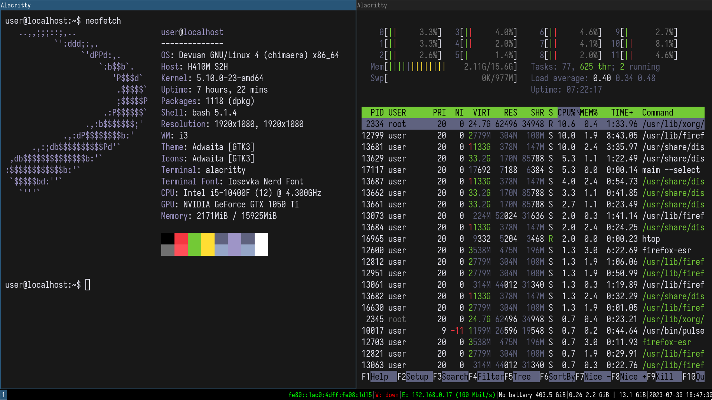

# My dotfiles for daily usage
There are my current configuration files that i use in my daily work. Feel free to use, copy, edit, redistribute, do whatever you want with my configuration files.
## Overview
### Neovim

### alacritty

### i3 and default wallpaper

## Installation
- Clone this repo.
- Execute the install script (install.sh)
This install script will moov every configuration files into ~/.config/, add some nerd fonts in ~/.local/share/fonts/ and add some wallpapers in ~/Pictures/wallpapers.
Feel free to edit the install script to your liking and your needs.
## Thanks
- [anthdm's Neovim configuration](https://github.com/anthdm/.nvim) for inspiration
- [cdunku's Alacritty configuration](https://github.com/cdunku/dotfiles/tree/main/alacritty) for the gruber_darker theme (to match with the same neovim theme)

